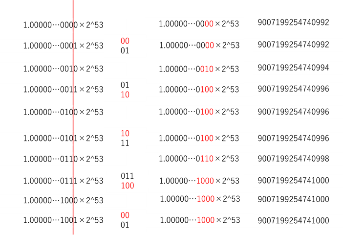

# 問題 3.2
## Number.MAX_SAFE_INTEGER + 1とNumber.MAX_SAFE_INTEGER + 2がTrueになる理由
Number.MAX_SAFE_INTEGERは53ビットの範囲で安全に表せる整数で最大値を取る。この値が9007199254740991である。  
53ビットを超えると最近接丸め（偶数）によって、53ビットに収まるように丸められる。  
54ビット目のようにはみ出し部分が0の場合はそのまま切り捨てられ、はみ出し部分が1の場合は下の隣人 = 保持部そのまま ＋ はみ出し部分を全部 0 にしたもの（切り捨て）と上の隣人 = 保持部に 1 を足したもの ＋ はみ出し部分は全部 0（1 目盛り上）で比較し、保持部が偶数になるものを選択して丸められる。  
Number.MAX_SAFE_INTEGER + 1は1.00000…0000×2^53になり、末尾が0なのでそのまま9007199254740992になる。  
Number.MAX_SAFE_INTEGER + 2は1.00000…0001×2^53になり、末尾が1なので1.00000…0000と1.00000…0010の比較になる。  
保持部の比較すると00と01の比較になり、偶数である00が選択される。  
したがってNumber.MAX_SAFE_INTEGER + 2は1.00000…0000×2^53になり、9007199254740992になる。  
よって、Number.MAX_SAFE_INTEGER + 1とNumber.MAX_SAFE_INTEGER + 2の値が同じになり、(Number.MAX_SAFE_INTEGER + 1) === (Number.MAX_SAFE_INTEGER + 2)はTrueになる。  
Number.MAX_SAFE_INTEGER + 1~Number.MAX_SAFE_INTEGER + 10の値は以下のように丸められ、コンソールで確かめて同じになることを確認した。  

